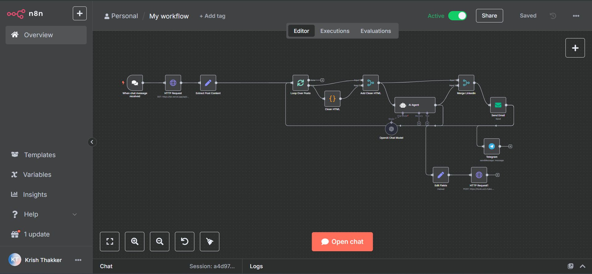
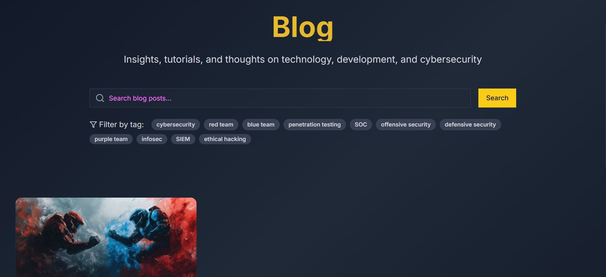
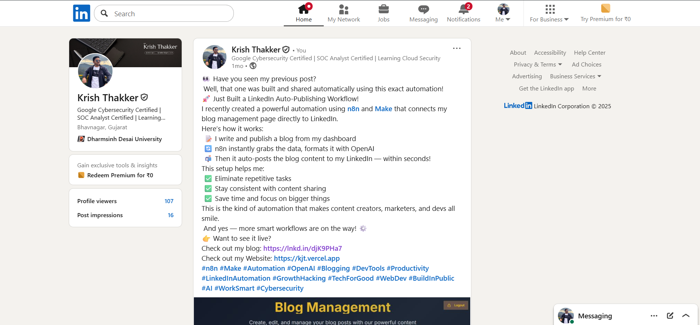

# LinkedIn Auto-Publishing Workflow 🚀

An automation system that takes a blog post from idea to live website and LinkedIn post — all without manual intervention.

---

## 📌 Overview
This project automates the full publishing process for blog posts using **n8n**, **Make**, and **OpenAI**.  
Once a blog is created in the dashboard, it is automatically:
1. Published to the website
2. Formatted using AI
3. Shared to LinkedIn
4. Sent via email notification

This workflow eliminates repetitive tasks, ensures consistency, and saves significant time.

---

## 🖼 Preview
**Workflow Diagram:**  

**Example Blog Post on Website:**  

**Example LinkedIn Post:**  

---

## ✨ Features
- **One-Click Publish** – Write a blog in the the form and trigger the entire flow.
- **AI-Powered Formatting** – OpenAI processes and optimizes the blog content before publishing.
- **Automatic Multi-Channel Posting** – Blog appears on both the website and LinkedIn instantly.
- **Email Notifications** – Subscribers get notified as soon as a new blog is live.
- **Time-Saving Automation** – Cuts publishing time from hours to seconds.

---

## 🛠 Tech Stack
- **n8n** – Automation orchestration  
- **Make (Integromat)** – Workflow integration and LinkedIn API handling  
- **OpenAI API** – Content formatting  
- **Custom Blog Dashboard** – Blog creation and management  
- **LinkedIn API** – Automated posting  
- **Email Service** – For subscriber notifications  

---

## 🚀 Benefits
- Zero repetitive copy-paste work  
- Consistent and timely sharing of content  
- Increased audience reach through instant LinkedIn publishing  
- More time to focus on creating high-quality content  

---

## 🔗 Live Links
- **Website:** [https://krishthakker.tech](https://krishthakker.tech)  
- **Blog Post Example:** [https://www.krishthakker.tech/blog/red-team-vs-blue-team-inside-the-battlefield]([https://lnkd.in/djK9PHa7](https://www.krishthakker.tech/blog/red-team-vs-blue-team-inside-the-battlefield))  

---

## 📧 Contact
For collaborations or technical queries:  
- **Email:** kjthakker8@gmail.com
- **LinkedIn:** [Linkedin](https://linkedin.com/in/krishthakker08)
